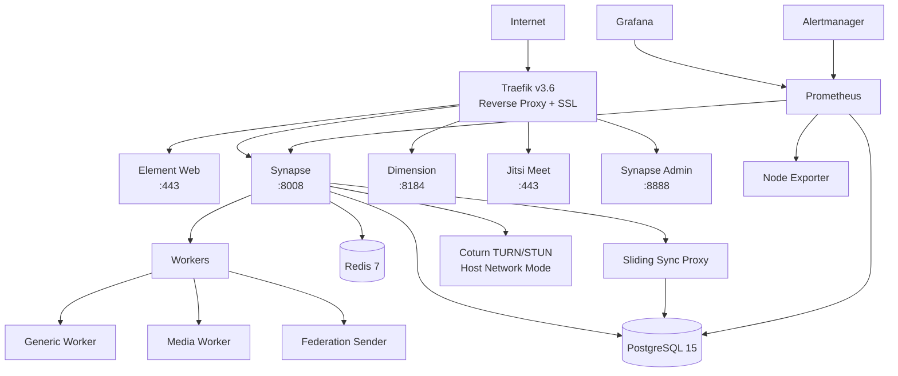

# 🚀 Matrix Homeserver - Complete Self-Hosted Solution

[](https://matrix.org)
[](https://www.docker.com/)
[](https://traefik.io/)

Production-ready Matrix homeserver deployment with Synapse, Element Web, Jitsi Meet, monitoring stack, and complete automation.

## 📋 Table of Contents

- [Features](#-features)
- [Architecture](#-architecture)
- [Quick Start](#-quick-start)
- [Detailed Setup](#-detailed-setup)
- [Services](#-services)
- [Configuration](#-configuration)
- [Monitoring](#-monitoring)
- [Backup & Restore](#-backup--restore)
- [Troubleshooting](#-troubleshooting)
- [Security](#-security)
- [Maintenance](#-maintenance)

---

## ✨ Features

### Core Services
- **Matrix Synapse** - Homeserver with worker support (generic, media, federation)
- **Element Web** - Modern web client
- **Sliding Sync** - Fast sync for Element X mobile
- **Dimension** - Integration manager for bots and bridges
- **Synapse Admin** - Web-based admin interface

### Communication
- **Jitsi Meet** - Self-hosted video conferencing
- **Coturn** - TURN/STUN server for VoIP (optimized, no memory leak!)

### Infrastructure
- **Traefik v3.6** - Reverse proxy with automatic SSL (Let's Encrypt)
- **PostgreSQL 15** - Database with optimized settings
- **Redis 7** - Cache and session storage

### Monitoring & Alerts
- **Prometheus** - Metrics collection
- **Grafana** - Visualization dashboards
- **Alertmanager** - Alert routing
- **Node Exporter** - System metrics
- **pgAdmin** - PostgreSQL management

### Automation
- **Automated Setup** - One-command deployment
- **SSL Certificates** - Automatic renewal
- **Backup Scripts** - Encrypted backups with GPG
- **Health Checks** - Container health monitoring

---

## 🏗️ Architecture



**Key Design Decisions:**
- **Traefik** handles all HTTPS traffic with automatic SSL
- **Coturn** uses `network_mode: host` to avoid 16GB memory leak
- **Workers** distribute Synapse load across multiple processes
- **Monitoring** stack provides full observability

---

## 📋 Requirements

### System Requirements
- **OS**: Linux (Ubuntu 20.04+, Debian 11+)
  - ✅ Tested on Debian 12 (Bookworm)
  - ✅ Tested on Debian 13 (Trixie)
- **RAM**: 4GB minimum, 8GB recommended
- **Disk**: 20GB minimum, 50GB+ recommended
- **CPU**: 2 cores minimum, 4+ recommended
- **Ports**: 80, 443, 3478, 5349, 49152-50151 open

---

## 🚀 Quick Start

### Prerequisites

- Ubuntu 20.04+ / Debian 11+ (or any Linux with Docker)
- Domain name with DNS configured

### One-Command Deployment

```bash
# Clone repository
git clone https://github.com/iam-rizz/Selfhost-Matrix.git
cd Selfhost-Matrix

# Copy and configure environment
cp .env.example .env
nano .env  # Edit with your settings

# Run setup (creates directories, generates secrets, configures services)
./setup.sh

# Start all services
docker compose up -d

# Check status
docker compose ps
```

**That's it!** Your Matrix server is now running at `https://your-domain.com`

---

## 📖 Detailed Setup

### Step 1: Server Preparation

```bash
# Update system
sudo apt update && sudo apt upgrade -y

# Install Docker
curl -fsSL https://get.docker.com -o get-docker.sh
sudo sh get-docker.sh
sudo usermod -aG docker $USER
newgrp docker

# Install Docker Compose
sudo apt install docker-compose-plugin -y

# Verify installation
docker --version
docker compose version
```

### Step 2: DNS Configuration

Configure DNS records for your domain:

| Type | Name | Value | TTL |
|------|------|-------|-----|
| A | `@` | `YOUR_SERVER_IP` | 300 |
| A | `element` | `YOUR_SERVER_IP` | 300 |
| A | `dimension` | `YOUR_SERVER_IP` | 300 |
| A | `meet` | `YOUR_SERVER_IP` | 300 |
| A | `traefik` | `YOUR_SERVER_IP` | 300 |
| SRV | `_matrix._tcp` | `10 0 8448 your-domain.com` | 300 |

**For root domain Synapse:**
- Set `USE_ROOT_DOMAIN=true` in `.env`
- Synapse will be at `https://your-domain.com`

**For subdomain Synapse:**
- Set `USE_ROOT_DOMAIN=false` in `.env`
- Synapse will be at `https://chat.your-domain.com`

### Step 3: Environment Configuration

```bash
# Copy example config
cp .env.example .env

# Edit configuration
nano .env
```

**Required Settings:**

```bash
# Domain
DOMAIN=your-domain.com
USE_ROOT_DOMAIN=true  # or false for subdomain

# Email for SSL certificates
ACME_EMAIL=admin@your-domain.com

# PostgreSQL (auto-generated or set manually)
POSTGRES_PASSWORD=<strong-password>

# Redis
REDIS_PASSWORD=<strong-password>

# Synapse secrets (auto-generated by setup.sh)
SYNAPSE_REGISTRATION_SHARED_SECRET=<auto-generated>
SYNAPSE_MACAROON_SECRET_KEY=<auto-generated>

# Traefik Dashboard
TRAEFIK_DASHBOARD_USER=admin
TRAEFIK_DASHBOARD_PASSWORD=<bcrypt-hash>  # Generate with scripts/generate-traefik-password.sh
```

**Generate Traefik Password:**

```bash
./scripts/generate-traefik-password.sh
# Enter password when prompted
# Copy the bcrypt hash to .env
```

### Step 4: Run Setup Script

```bash
./setup.sh
```

**What setup.sh does:**
1. ✅ Creates all required directories with correct permissions
2. ✅ Generates random secrets for all services
3. ✅ Substitutes environment variables in config files
4. ✅ Fixes permissions for Prometheus, Grafana, pgAdmin, Dimension
5. ✅ Validates configuration
6. ✅ Shows deployment summary

### Step 5: Start Services

```bash
# Start all services
docker compose up -d

# Watch logs
docker compose logs -f

# Check status
docker compose ps
```

### Step 6: Create Admin User

```bash
# Register first user (admin)
docker exec -it matrix-synapse register_new_matrix_user \
    -c /data/homeserver.yaml \
    http://localhost:8008

# Follow prompts:
# Username: admin
# Password: <your-password>
# Make admin: yes
```

### Step 7: Verify Deployment

**Check Federation:**
```bash
curl https://federationtester.matrix.org/api/report?server_name=your-domain.com
```

**Access Services:**
- Element Web: `https://element.your-domain.com`
- Synapse Admin: `http://localhost:8888`
- Dimension: `https://dimension.your-domain.com`
- Jitsi Meet: `https://meet.your-domain.com`
- Traefik Dashboard: `https://traefik.your-domain.com/dashboard/`
- Grafana: `http://localhost:3000`
- Prometheus: `http://localhost:9090`
- pgAdmin: `http://localhost:5050`

---

## 🔧 Services

### Matrix Synapse

**Main Process:**
- Handles client API, federation, media
- Delegates work to workers

**Workers:**
- `generic_worker` - Client sync, typing, presence
- `media_worker` - Media upload/download
- `federation_sender` - Outbound federation

**Configuration:**
- File: `synapse/homeserver.yaml`
- Logs: `synapse-data/logs/`
- Database: PostgreSQL `synapse` database

### Element Web

Modern Matrix web client with custom branding support.

**Configuration:**
- File: `element/config.json`
- Customization: `element/config.json` (themes, branding)

### Coturn (TURN/STUN)

**Optimized Configuration:**
- ✅ Host network mode (no memory leak!)
- ✅ 1000 ports (49152-50151) instead of 16K
- ✅ Connection limits (10 per user, 100 total)
- ✅ Bandwidth limit (3 Mbps)
- ✅ No verbose logging

**Memory Usage:**
- Expected: 50-100MB
- Max limit: 256MB (safety)

**Configuration:**
- File: `coturn/turnserver.conf`
- Ports: 3478, 5349, 49152-50151

### Traefik

**Features:**
- Automatic SSL with Let's Encrypt
- HTTP to HTTPS redirect
- Dashboard with authentication
- Docker provider (auto-discovery)

**Configuration:**
- Static: `traefik/traefik.yml`
- Dynamic: Docker labels in `docker-compose.yml`

**Dashboard Access:**
```bash
# URL: https://traefik.your-domain.com/dashboard/
# User: From TRAEFIK_DASHBOARD_USER
# Password: From TRAEFIK_DASHBOARD_PASSWORD
```

### Monitoring Stack

**Prometheus:**
- Scrapes metrics from Synapse, Node Exporter, PostgreSQL
- Retention: 15 days
- Port: 9090

**Grafana:**
- Pre-configured dashboards
- User: `admin`
- Password: From `GF_SECURITY_ADMIN_PASSWORD`
- Port: 3000

**Alertmanager:**
- Alert routing and notifications
- Port: 9093

---

## ⚙️ Configuration

### Domain Configuration

**Root Domain Mode** (`USE_ROOT_DOMAIN=true`):
```
Synapse: https://your-domain.com
Element: https://element.your-domain.com
Dimension: https://dimension.your-domain.com
```

**Subdomain Mode** (`USE_ROOT_DOMAIN=false`):
```
Synapse: https://chat.your-domain.com
Element: https://element.your-domain.com
Dimension: https://dimension.your-domain.com
```

### SSL Certificates

Traefik automatically obtains and renews Let's Encrypt certificates.

**Certificate Storage:**
```
traefik-data/letsencrypt/acme.json
```

**Force Renewal:**
```bash
# Remove acme.json
rm traefik-data/letsencrypt/acme.json

# Restart Traefik
docker compose restart traefik
```

### Synapse Configuration

**Enable Registration:**
```yaml
# synapse/homeserver.yaml
enable_registration: true
registration_shared_secret: "your-secret"
```

**Disable Registration:**
```yaml
enable_registration: false
```

**Max Upload Size:**
```yaml
max_upload_size: 200M  # Adjust in .env
```

### Worker Configuration

Workers are automatically configured by `setup.sh`.

**Scaling Workers:**

Edit `docker-compose.yml`:
```yaml
synapse-worker-generic:
  deploy:
    replicas: 2  # Scale to 2 instances
```

---

## 📊 Monitoring

### Grafana Dashboards

**Access:** `http://localhost:3000`  
**Login:** admin / `<GF_SECURITY_ADMIN_PASSWORD from .env>`

**Available Dashboards:**

| Dashboard | Source | Metrics |
|-----------|--------|---------|
| **Synapse** | Official (GitHub) | DAU/MAU, requests, database, cache, federation |
| **Node Exporter** | ID: 1860 | CPU, memory, disk, network, system stats |
| **Prometheus Stats** | ID: 19105 | Prometheus metrics, scrape stats, TSDB |
| **Traefik** | ID: 17346 | Requests, response times, TLS, backends |

**Location:** Dashboards → Browse → Matrix folder

**Auto-provisioned from:** `grafana/provisioning/dashboards/`

### Prometheus Targets

**Access:** `http://localhost:9090/targets`

**All targets should be UP:**
- ✅ `synapse` (synapse:9000) - Matrix homeserver metrics
- ✅ `node-exporter` (node-exporter:9100) - System metrics
- ✅ `prometheus` (localhost:9090) - Self-monitoring
- ✅ `traefik` (traefik:8080) - Reverse proxy metrics

### Useful Prometheus Queries

**Active Users (DAU):**
```promql
synapse_admin_mau:current{job="synapse"}
```

**Request Rate:**
```promql
rate(synapse_http_server_requests_total[5m])
```

**Request Latency (p95):**
```promql
histogram_quantile(0.95, rate(synapse_http_server_response_time_seconds_bucket[5m]))
```

**Database Connections:**
```promql
synapse_database_connections
```

**Cache Hit Rate:**
```promql
rate(synapse_util_caches_cache_hits[5m]) / (rate(synapse_util_caches_cache_hits[5m]) + rate(synapse_util_caches_cache_misses[5m]))
```

**Traefik Request Rate:**
```promql
rate(traefik_entrypoint_requests_total[5m])
```

### Logs

**View All Logs:**
```bash
docker compose logs -f
```

**Service-Specific:**
```bash
docker logs -f matrix-synapse
docker logs -f matrix-traefik
docker logs -f matrix-coturn
docker logs -f matrix-grafana
```

**Synapse Logs:**
```bash
tail -f synapse-data/logs/homeserver.log
```

**Filter Errors:**
```bash
docker logs matrix-synapse 2>&1 | grep -i error
```

---

## 💾 Backup & Restore

## 💾 Backup & Recovery

### Backup Strategy

**3-2-1 Backup Rule:**
- **3** copies: Original + Local backup + Offsite (Telegram/Cloud)
- **2** different media: Disk + Cloud storage
- **1** offsite: Telegram or rclone remote

---

### Automated Backups (Cron)

All backup scripts are automatically scheduled during setup:

| Script | Schedule | Purpose | Log File |
|--------|----------|---------|----------|
| `backup-postgres.sh` | Daily 3 AM | PostgreSQL dump + GPG encryption | `logs/backup.log` |
| `offsite-backup.sh` | Daily 4 AM | Send to Telegram (3 newest files) | `logs/offsite.log` |
| `health-check.sh` | Every 5 min | Service health monitoring | `logs/health.log` |
| `monitor-resources.sh` | Every 10 min | RAM/disk usage alerts | `logs/monitor.log` |

**View cron jobs:**
```bash
crontab -l
```

---

### 1. Local Backup (PostgreSQL)

**Script:** `scripts/backup-postgres.sh`

**Features:**
- ✅ PostgreSQL database dump
- ✅ Gzip compression
- ✅ Optional GPG encryption
- ✅ 7-day retention (configurable)
- ✅ Telegram notifications
- ✅ Automatic cleanup

**Configuration (.env):**
```bash
GPG_RECIPIENT=your-gpg-key-id          # Optional: Enable encryption
BACKUP_RETENTION_DAYS=7                # Keep backups for 7 days
TELEGRAM_BOT_TOKEN=your-bot-token      # Optional: Notifications
TELEGRAM_CHAT_ID=your-chat-id
```

**Manual run:**
```bash
bash scripts/backup-postgres.sh
```

**Output:**
```
backups/synapse_db_20260216_030001.sql.gz      # Unencrypted
backups/synapse_db_20260216_030001.sql.gz.gpg  # Encrypted (if GPG configured)
```

**Setup GPG encryption:** See [GPG Backup Encryption Guide](docs/GPG_BACKUP_ENCRYPTION.md)

---

### 2. Offsite Backup (Telegram)

**Script:** `scripts/offsite-backup.sh`

**Strategy:** Telegram-first (reliable, instant, no hanging issues)

**Features:**
- ✅ Send 3 most recent backups to Telegram
- ✅ 50MB file limit (sufficient for compressed DBs)
- ✅ Instant confirmation
- ✅ Accessible from any device
- ✅ Timeout protection (30s per file)
- ✅ Summary notifications

**Configuration (.env):**
```bash
TELEGRAM_BOT_TOKEN=123456:ABC-DEF...
TELEGRAM_CHAT_ID=123456789
```

**Manual run:**
```bash
bash scripts/offsite-backup.sh
```

**Telegram receives:**
- 📁 Backup files (directly in chat)
- 📊 Summary notification
- 📦 File metadata (name, size, timestamp)

**Optional: rclone (currently disabled)**
- Can be re-enabled for cloud storage (S3, B2, Wasabi)
- See `scripts/offsite-backup.sh` to uncomment rclone section

---

### 3. Manual Backup

```bash
# PostgreSQL only
docker exec matrix-postgres pg_dump -U synapse synapse | gzip > backup.sql.gz

# All databases
docker exec matrix-postgres pg_dumpall -U synapse > all-databases.sql

# Media files
tar -czf media-backup.tar.gz synapse-data/media_store/

# Configuration
tar -czf config-backup.tar.gz .env synapse/ traefik/ prometheus/
```

---

### 4. Restore from Backup

#### Restore PostgreSQL

```bash
# If encrypted with GPG
gpg --decrypt backups/synapse_db_20260216_030001.sql.gz.gpg | gunzip > backup.sql

# If unencrypted
gunzip backups/synapse_db_20260216_030001.sql.gz

# Restore to database
docker exec -i matrix-postgres psql -U synapse synapse < backup.sql

# Restart Synapse
docker compose restart synapse
```

#### Restore from Telegram

1. Open Telegram chat with bot
2. Download backup file
3. Transfer to server
4. Follow restore steps above

---

### 5. Backup Verification

```bash
# Check local backups
ls -lh backups/

# Check backup logs
tail -f synapse-data/logs/backup.log
tail -f synapse-data/logs/offsite.log

# Test GPG decryption
gpg --decrypt backups/synapse_db_*.sql.gz.gpg > /dev/null

# Verify Telegram delivery
# Check bot chat for files and notifications
```

---

### 6. Troubleshooting

**Backup not encrypted:**
- GPG key not configured → See [GPG Guide](docs/GPG_BACKUP_ENCRYPTION.md)
- GPG_RECIPIENT not set in .env
- GPG key not found

**Telegram not receiving files:**
- Check TELEGRAM_BOT_TOKEN and TELEGRAM_CHAT_ID in .env
- Verify bot has permission to send files
- Check logs: `tail -f synapse-data/logs/offsite.log`

**Disk space full:**
- Reduce BACKUP_RETENTION_DAYS in .env
- Clean old backups: `find backups/ -mtime +7 -delete`
- Check disk usage: `df -h`

---

### 7. Backup Best Practices

✅ **Test restoration monthly** - Verify backups actually work
✅ **Monitor backup logs** - Check for failures
✅ **Keep multiple copies** - Local + Telegram + Cloud
✅ **Encrypt sensitive data** - Use GPG for production
✅ **Document recovery** - Write down restore procedure
✅ **Rotate GPG keys** - Annually for security

# Restore PostgreSQL
docker exec -i matrix-postgres psql -U synapse < backup.sql

# Restore media
tar -xzf media-backup.tar.gz -C synapse-data/

# Restart services
docker compose restart
```

---

## 🔍 Troubleshooting

### Common Issues

#### 1. Traefik DOWN in Prometheus ❌ → ✅

**Symptoms:**
- Prometheus showing Traefik target as DOWN
- Error: `connection refused` on port 8082

**Root Cause:**
- Traefik v3 exposes metrics on port **8080** (not 8082)
- Metrics entrypoint not configured

**Solution:**
```bash
# Already fixed in latest version
git pull origin main
docker compose restart traefik prometheus

# Verify metrics endpoint
curl http://localhost:8080/metrics

# Check Prometheus targets
http://localhost:9090/targets
# Traefik should be UP now
```

**Details:** See [docs/TRAEFIK_METRICS_FIX.md](docs/TRAEFIK_METRICS_FIX.md)

#### 2. Grafana Dashboard Showing N/A

**Symptoms:**
- Dashboard panels show "N/A" or "No data"

**Common Causes:**

**A. Wrong Datasource:**
```bash
# Check Grafana datasource
http://localhost:3000/datasources

# Should show: Prometheus (http://prometheus:9090)
# Click "Save & Test" - should show "Data source is working"
```

**B. Incompatible Dashboard:**
```bash
# Some dashboards use wrong datasource variables
# Example: ${DS_THEMIS} instead of Prometheus

# Solution: Use dashboards from our repo
git pull origin main
docker compose restart grafana
```

**C. Metrics Not Available:**
```bash
# Check if service exposes metrics
curl http://localhost:9000/metrics  # Synapse
curl http://localhost:8080/metrics  # Traefik
curl http://localhost:9100/metrics  # Node Exporter

# Check Prometheus scraping
http://localhost:9090/targets
# All targets should be UP
```

#### 3. Grafana Dashboard Not Loading

**Error:**
```
failed to walk provisioned dashboards: no such file or directory
```

**Solution:**
```bash
# Verify dashboard files exist
ls -la grafana/provisioning/dashboards/

# Should show:
# - synapse.json
# - node-exporter.json
# - prometheus-stats.json
# - traefik.json

# If missing, pull latest
git pull origin main

# Restart Grafana
docker compose restart grafana
```

#### 4. Coturn Memory Leak (16GB RAM)

**Symptoms:**
- Coturn consuming all system memory
- Server becomes unresponsive

**Solution:**
```bash
# Already fixed with network_mode: host
git pull origin main
docker compose up -d coturn

# Verify memory usage (should be < 100MB)
docker stats matrix-coturn
```

**Root Cause:** Port mapping overhead in bridge mode.  
**Details:** See [docs/COTURN_MEMORY_FIX.md](docs/COTURN_MEMORY_FIX.md)

#### 5. SSL Certificate Not Generating

**Check:**
```bash
# View Traefik logs
docker logs matrix-traefik | grep -i acme

# Check DNS
dig your-domain.com

# Verify ports 80 and 443 are open
sudo ufw status
```

**Solution:**
```bash
# Ensure DNS points to server
# Wait 5-10 minutes for DNS propagation

# Force certificate renewal
rm traefik-data/letsencrypt/acme.json
docker compose restart traefik
```

#### 6. Prometheus Permission Denied

**Error:**
```
level=error msg="Error opening memory series storage: lock DB directory: permission denied"
```

**Solution:**
```bash
chmod -R 777 prometheus-data
docker compose restart prometheus
```

#### 7. Dimension Access Token Invalid

**Error:**
```
M_UNKNOWN_TOKEN: Invalid access token passed
```

**Solution:**
```bash
# Create dimension user
docker exec -it matrix-synapse register_new_matrix_user \
    -c /data/homeserver.yaml http://localhost:8008
# Username: dimension
# Password: <password>
# Admin: no

# Get access token
curl -X POST "http://localhost:8008/_matrix/client/r0/login" \
    -H "Content-Type: application/json" \
    -d '{"type":"m.login.password","user":"dimension","password":"<password>"}'

# Copy access_token to .env
nano .env
# DIMENSION_ACCESS_TOKEN=<token>

# Regenerate config
./setup.sh

# Restart
docker compose up -d dimension
```

#### 8. Sliding Sync Database Missing

**Error:**
```
panic: pq: database "syncv3" does not exist
```

**Solution:**
```bash
# Create database
docker exec -it matrix-postgres psql -U synapse -c "CREATE DATABASE syncv3;"
docker exec -it matrix-postgres psql -U synapse -c "GRANT ALL PRIVILEGES ON DATABASE syncv3 TO synapse;"

# Restart
docker compose up -d sliding-sync
```

### Health Checks

```bash
# Check all containers
docker compose ps

# Check specific service
docker compose ps synapse

# View resource usage
docker stats

# Check disk space
df -h
```

---

## 🔒 Security

### Firewall Configuration

```bash
# Install UFW
sudo apt install ufw -y

# Default policies
sudo ufw default deny incoming
sudo ufw default allow outgoing

# Allow SSH
sudo ufw allow 22/tcp

# Allow HTTP/HTTPS (Traefik)
sudo ufw allow 80/tcp
sudo ufw allow 443/tcp

# Allow Coturn
sudo ufw allow 3478/tcp
sudo ufw allow 3478/udp
sudo ufw allow 5349/tcp
sudo ufw allow 5349/udp
sudo ufw allow 49152:50151/udp

# Enable firewall
sudo ufw enable
```

### Coturn Security (Host Mode)

**Why Host Mode is Safe:**
1. ✅ Process isolation maintained
2. ✅ Filesystem isolation maintained
3. ✅ Resource limits enforced (256MB)
4. ✅ UFW firewall protection
5. ✅ denied-peer-ip blocks private IPs
6. ✅ Connection quotas prevent abuse

**Security Features in Config:**
```conf
# Block private IP ranges
denied-peer-ip=10.0.0.0-10.255.255.255
denied-peer-ip=192.168.0.0-192.168.255.255

# Limit connections
user-quota=10
total-quota=100

# Bandwidth limit
max-bps=3000000
```

### SSL/TLS

- ✅ Automatic HTTPS with Let's Encrypt
- ✅ TLS 1.2+ only (no TLS 1.0/1.1)
- ✅ Strong cipher suites
- ✅ HSTS enabled

### Regular Updates

```bash
# Update Docker images
docker compose pull

# Restart with new images
docker compose up -d

# Clean old images
docker image prune -a
```

---

## 🛠️ Maintenance

### Regular Tasks

**Daily:**
- Monitor Grafana dashboards
- Check disk space
- Review error logs

**Weekly:**
- Update Docker images
- Review backup logs
- Check SSL certificate expiry

**Monthly:**
- Database vacuum
- Clean old media files
- Review user activity

### Database Maintenance

```bash
# Vacuum PostgreSQL
docker exec matrix-postgres vacuumdb -U synapse -d synapse -v

# Analyze tables
docker exec matrix-postgres psql -U synapse -d synapse -c "ANALYZE;"
```

### Media Cleanup

```bash
# Remove old cached remote media (older than 30 days)
docker exec matrix-synapse \
    curl -X POST "http://localhost:8008/_synapse/admin/v1/media/delete?before_ts=$(date -d '30 days ago' +%s)000" \
    -H "Authorization: Bearer <admin-token>"
```

### Scaling

**Increase Workers:**
```yaml
# docker-compose.yml
synapse-worker-generic:
  deploy:
    replicas: 3  # Scale to 3 instances
```

**Increase PostgreSQL Resources:**
```yaml
postgres:
  command:
    - "postgres"
    - "-c"
    - "shared_buffers=512MB"  # Increase from 256MB
    - "-c"
    - "effective_cache_size=1GB"  # Increase from 512MB
```

---

## 📚 Additional Documentation

### Setup & Configuration
- [Complete Deployment Guide](docs/DEPLOYMENT.md)
- [Security Hardening](docs/SECURITY.md)
- [Root Domain Support](docs/ROOT_DOMAIN.md)

### Monitoring & Troubleshooting
- [Grafana Dashboard Setup](docs/GRAFANA_DASHBOARD.md)
- [Traefik Metrics Fix](docs/TRAEFIK_METRICS_FIX.md)
- [Coturn Memory Fix Guide](docs/COTURN_MEMORY_FIX.md)
- [Traefik Dashboard Authentication](docs/TRAEFIK_AUTH.md)

### Backup & Security
- [Database Restore Guide](docs/DATABASE_RESTORE.md)
- [GPG Backup Encryption](docs/GPG_BACKUP_ENCRYPTION.md)

---

## 🤝 Contributing

Contributions welcome! Please:
1. Fork the repository
2. Create a feature branch
3. Make your changes
4. Submit a pull request

---

## 📄 License

MIT License - See LICENSE file for details

---

## 🙏 Acknowledgments

- [Matrix.org](https://matrix.org) - Decentralized communication protocol
- [Synapse](https://github.com/matrix-org/synapse) - Matrix homeserver
- [Element](https://element.io) - Matrix client
- [Traefik](https://traefik.io) - Modern reverse proxy
- [Jitsi](https://jitsi.org) - Video conferencing

---

## 📞 Support

- **Issues:** [GitHub Issues](https://github.com/iam-rizz/Selfhost-Matrix/issues)
- **Matrix Room:** `#selfhost-matrix:your-domain.com`
- **Documentation:** [Wiki](https://github.com/iam-rizz/Selfhost-Matrix/wiki)

---

**Made with ❤️ for the Matrix community**
